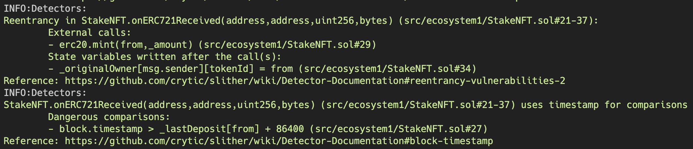
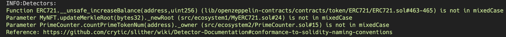
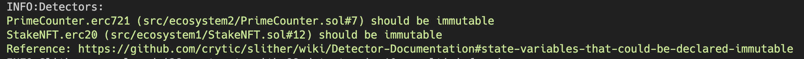

## Week2 analysis

```solidity
    function onERC721Received(
        address,
        address from,
        uint256 tokenId,
        bytes calldata
    ) external returns (bytes4) {
        if (block.timestamp > _lastDeposit[from] + 24 hours) {
            uint256 _amount = 10 * 10 ** erc20.decimals();
            erc20.mint(from, _amount);

            _lastDeposit[from] = block.timestamp;

            // Here, msg.sender will be the NFT contract.
            _originalOwner[msg.sender][tokenId] = from;
        }
        return IERC721Receiver.onERC721Received.selector;
    }
```




```solidity
		function countPrimeTokenNum(
        address _owner
    ) external view returns (uint256 num) {
        uint256 tokenCounts = erc721.balanceOf(_owner);

        for (uint256 i = 0; i < tokenCounts; ) {
            uint256 tokenId = erc721.tokenOfOwnerByIndex(_owner, i);

            if (_isPrime(tokenId)) {
                unchecked {
                    num++;
                }
            }

            unchecked {
                i++;
            }
        }
    }
```




```solidity
 MyEnumerableNFT private erc721;
```


